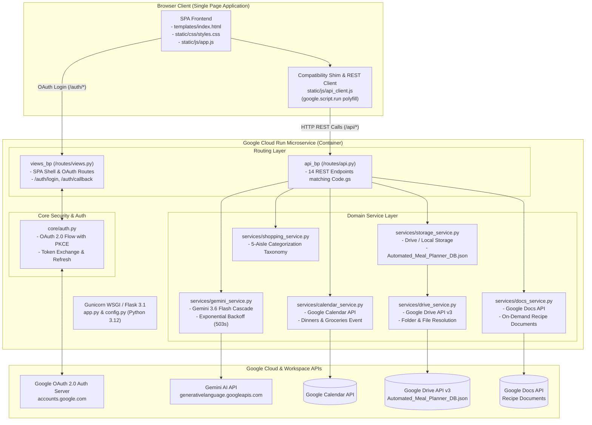

# Executive Summary: Meal Planning Assistant (Cloud Run Architecture)

**Date:** September 26, 2026  
**Status:** ✅ Production-Ready | 21 Automated Tests Passing (Python 3.12) | OAuth 2.0 Verified  
**Key Docs:** [Product Review](file:///c:/Users/philp/Documents/Google%20Cloud%20Project/Meal%20Planning/docs/PRODUCT_REVIEW.md) | [Prompt Evaluation Protocol](file:///c:/Users/philp/Documents/Google%20Cloud%20Project/Meal%20Planning/docs/PROMPT_EVALUATION_PROTOCOL.md) | [Refactoring Spec](file:///c:/Users/philp/Documents/Google%20Cloud%20Project/Meal%20Planning/spec/cloud_run_refactoring_spec.md) | [README.md](file:///c:/Users/philp/Documents/Google%20Cloud%20Project/Meal%20Planning/README.md)

---

## 1. Executive Overview & Transformation Journey

The **Meal Planning Assistant** has completed a comprehensive architectural refactoring, evolving from a standalone Google Apps Script (GAS) web app into a high-performance, containerized **Python 3.12 / Flask** microservice engineered for **Google Cloud Run** under project **`meal-planning-app-507921`**.

This migration achieves 100% visual, functional, and data parity with the original application while unlocking enterprise scalability, sub-second execution speeds, robust OAuth 2.0 Web Authentication with PKCE, and automated CI/CD container deployments.

### Major Evolution Milestones

| Phase | Milestone | Core Transformation Delivered |
| :--- | :--- | :--- |
| **GAS Prototype** | *Legacy Apps Script* | Single-file script (`Code.gs`) limited by Apps Script 6-minute execution limits, quota throttling, and `google.script.run` latency. |
| **Phase 1: Architecture Spec** | *Cloud Run Blueprint* | Established comprehensive refactoring specification ([spec/cloud_run_refactoring_spec.md](file:///c:/Users/philp/Documents/Google%20Cloud%20Project/Meal%20Planning/spec/cloud_run_refactoring_spec.md)) defining REST API endpoints, service layer modularity, and OAuth 2.0 Web Sign-In (Option A). |
| **Phase 2: Scaffolding & Core** | *Container & Backend Services* | Built modern Flask app factory, configuration system with `.env`, custom error hierarchy, and 5 specialized services (`gemini_service`, `calendar_service`, `docs_service`, `drive_service`, `storage_service`). |
| **Phase 3: Frontend Extraction** | *Asset Modularization* | Decoupled monolithic HTML into Jinja2 templates (`templates/index.html`), standalone premium stylesheet (`static/css/styles.css`), clean application controller (`static/js/app.js`), and REST API client (`static/js/api_client.js`) featuring a backward-compatible `google.script.run` shim. |
| **Phase 4: OAuth 2.0 & Security** | *Web Sign-In with PKCE* | Implemented Google OAuth 2.0 Web Flow with PKCE (`code_verifier` / `code_challenge`), secure session management (`SameSite=Lax`), automatic token refresh, and user profile badges. |
| **Phase 5: Python 3.12 Upgrade** | *Runtime Modernization* | Upgraded local `.venv` and Dockerfile base container to **Python 3.12.10**, resolving `google.api_core` deprecation warnings and future-proofing the deployment. |
| **Phase 6: Automated Testing** | *Pytest Verification* | Created 21 automated integration and unit tests validating API routes, Gemini cascade retries, shopping aisle taxonomy, and Drive storage migrations. |

---

## 2. Current State of the Application

* **Stability & Automated Test Suite:** 100% green with **21 automated pytest tests** passing in `0.42s` on Python 3.12 with **0 warnings**.
* **Authentication Infrastructure:** Fully operational Google OAuth 2.0 Web Sign-In with PKCE. Users sign in securely using their personal Google Accounts, granting granular scopes for Calendar, Drive file management, Docs, and user profile.
* **Serverless Containerization:** Docker container built on `python:3.12-slim` using Gunicorn WSGI (`1 worker, 8 threads`), optimized for instantaneous cold starts and auto-scaling to zero on Google Cloud Run.
* **Core Application Capabilities:**
  1. **Calendar-First Weekly Scheduling:** Schedules dinner events on the user's primary Google Calendar with full recipe descriptions, diner-scaled ingredients, and step-by-step cooking instructions. Additionally creates an aisle-categorized morning **"🛒 Groceries"** checklist event.
  2. **Intelligent AI Generation Cascade:** Generates customized weekly dinner plans via Google Gemini (`gemini-3.6-flash` $\rightarrow$ `gemini-3.5-flash` $\rightarrow$ `gemini-1.5-flash`) with automatic exponential backoff for transient 503 errors and defensive prompt engineering.
  3. **On-Demand "Create Recipe" Google Docs:** Rather than generating unwanted Drive clutter on every plan approval, users can generate a beautifully formatted Google Doc on-demand for specific dishes from the **History** and **Favorites** views (`📄 Create Recipe` / `📄 Open Doc`).
  4. **Plan Customization & Reroll:** Supports rerolling individual recipes (`🔄`), locking preferred recipes (`🔒`), and 1-click insertion of starred family favorites from history.
  5. **Natural-Language Dietary Preferences:** Freeform inputs for dietary guidelines, preferred cuisines (e.g., Italian, Mexican, Mediterranean, Asian-inspired), and lifestyle dislikes without rigid button matrices.
  6. **Zero-Friction API Key Management:** Supports a default starter key for instant AI recipe generation while allowing users to save personal Google AI Studio keys in the Settings view.
  7. **Resilient Drive Database Storage:** Seamless persistence in `Automated_Meal_Planner_DB.json` on the user's private Google Drive with local fallback support (`STORAGE_MODE=drive` or `local`).

---

## 3. Architecture & System Data Flow



---

## 4. Code Footprint & Modular Structure

The codebase is organized into clean, single-responsibility modules:

```text
Meal Planning/
├── Dockerfile                  # Container definition (python:3.12-slim + gunicorn)
├── deploy.ps1 / deploy.sh      # Cloud Run deployment automation scripts
├── requirements.txt            # Python dependencies (Flask, google-auth, pytest)
├── app.py                      # Flask Application Factory & Gunicorn entry point
├── config.py                   # Centralized configuration & environment loader
├── core/
│   ├── auth.py                 # OAuth 2.0 PKCE flow, credential cache & auto-refresh
│   ├── exceptions.py           # Custom domain exception hierarchy
│   └── config_keys.py          # Unified constants & configuration keys
├── services/
│   ├── gemini_service.py       # Gemini API caller with model cascade & retry logic
│   ├── calendar_service.py     # Calendar scheduling (dinners + groceries events)
│   ├── docs_service.py         # On-demand formatted recipe Google Doc generation
│   ├── drive_service.py        # Drive v3 file search, folder creation, & metadata
│   ├── storage_service.py      # Abstracted database persistence (Drive / local)
│   └── shopping_service.py     # 5-aisle ingredient categorization engine
├── routes/
│   ├── views.py                # SPA page serving & OAuth login/callback routes
│   └── api.py                  # All 14 REST API endpoints matching legacy Code.gs
├── templates/
│   └── index.html              # Clean Jinja2 Single Page Application template
├── static/
│   ├── css/styles.css          # Organic culinary dark theme, typography, & toasts
│   └── js/
│       ├── api_client.js       # Modern fetch() client + google.script.run shim
│       └── app.js              # State management, card locking, & user interactions
├── tests/                      # Automated test suite (21 tests, 100% passing)
│   ├── conftest.py             # Pytest fixtures & mock credentials
│   ├── test_api_routes.py      # REST API route integration tests
│   ├── test_gemini_service.py  # Model cascade & retry tests
│   ├── test_shopping_service.py# Grocery taxonomy & aisle sorting tests
│   └── test_storage_service.py # Schema migrations & storage abstraction tests
└── docs/                       # Project documentation
    ├── EXECUTIVE_SUMMARY.md    # This document
    ├── PRODUCT_REVIEW.md       # Formal product evaluation & ship decision
    └── PROMPT_EVALUATION_PROTOCOL.md # AI prompt engineering & safety evaluation
```

---

## 5. Security & Authentication Architecture

* **OAuth 2.0 Web Flow with PKCE:** Complies with modern RFC 7636 security standards. Prevents authorization code interception attacks by generating a cryptographic `code_verifier` and hashed `code_challenge`.
* **Zero Service Account Secret Exposure:** The application does not require high-privilege service account private keys to manage user data. Instead, it accesses Google Calendar, Drive, and Docs strictly under the user's personal OAuth consent.
* **Encrypted Client Sessions:** Session cookies are secured with `SESSION_COOKIE_HTTPONLY = True`, `SESSION_COOKIE_SAMESITE = "Lax"`, and a cryptographically strong `SECRET_KEY`.
* **Container Security:** Runs in Docker as an unprivileged non-root user (`appuser`, UID 1000) with minimal Debian slim attack surface.
* **Granular Least-Privilege Scopes:**
  * `calendar` — Create dinner and grocery events on the user's primary calendar.
  * `drive.file` — Access and create only the files created by the application (`Automated_Meal_Planner_DB.json` and recipe docs), with zero access to unrelated user files.
  * `documents` — Create on-demand recipe Google Docs.
  * `userinfo.email` & `userinfo.profile` — Display user identity in the header badge.

---

## 6. Release Status & Next Cycle Roadmap

### Completed Milestones
- [x] Full architectural migration from Google Apps Script to Python 3.12 / Flask.
- [x] 100% feature and visual parity verified locally.
- [x] Google Cloud project configured (`meal-planning-app-507921`) with all 6 required APIs enabled.
- [x] Google OAuth 2.0 Web Client configured, tested, and verified with PKCE.
- [x] Upgraded to Python 3.12 with zero warnings across all test suites.
- [x] Deployment automation scripts verified (`deploy.ps1` / `deploy.sh`).

### Priority Backlog for Next Deployment Cycle
- [ ] **Cloud Run Deployment Execution:** Run `.\deploy.ps1` to publish the service live and add the production URL to Authorized redirect URIs in GCP Console.
- [ ] **Intentional Leftover Engine ("Cook Once, Eat Twice"):** Add pairing logic to generate intentional batch-cooked meals (e.g., Sunday Roast Chicken $\rightarrow$ Monday Chicken Enchiladas).
- [ ] **Print-Friendly CSS (`@media print`):** Add print styles for 1-page kitchen index cards directly from the browser.
- [ ] **Grocery Aisle Customization:** Allow users to drag-and-drop the 5 shopping aisles to match their local supermarket layout.
