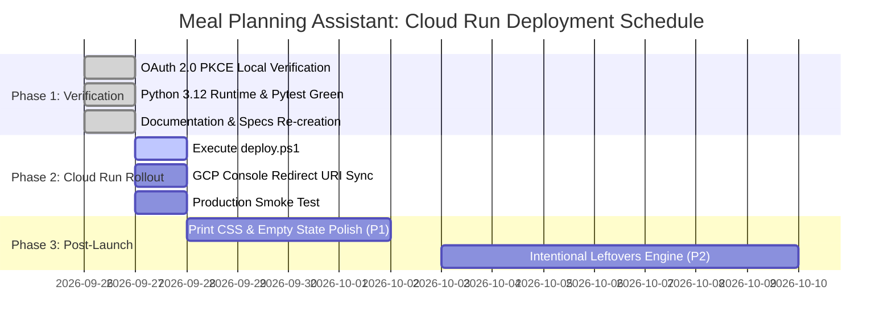

# Executive Product Review: Meal Planning Assistant (Cloud Run Edition)

**Reviewing Body:** Executive Product Review Team | Mile High Data Viz  
**Review Date:** September 26, 2026  
**Product:** Meal Planning Assistant (Google Cloud Run / Python 3.12 / Flask / Gemini AI)  
**Lead Developer:** Phil Perrin  
**Current Build Status:** ✅ Production-Ready | 21 Automated Tests Passing | OAuth 2.0 PKCE Verified  
**Ship Verdict:** **GO (Approved for Cloud Run Deployment)**

---

## 1. Executive Summary & Ship Verdict

### 1.1 Executive Summary

The Executive Product Review Team has evaluated the modernized **Meal Planning Assistant** application developed by Mile High Data Viz. Following its successful architectural refactoring from Google Apps Script to a containerized **Python 3.12 / Flask microservice on Google Cloud Run**, our evaluation evaluated six core pillars:

1. **Presentation & Aesthetics:** Visual design, brand consistency, typography, responsive ergonomics, and organic dark palette.
2. **Functional Execution:** Verification that AI generation, single-card rerolls, card locking, Google Calendar scheduling, and on-demand Google Docs function accurately and reliably.
3. **User Engagement & Workflow:** Elimination of cognitive friction, reduction in weekly decision fatigue, and integration into existing Google Calendar habits.
4. **Cloud Run Architecture & Security:** OAuth 2.0 Web Sign-In with PKCE, non-root Docker containerization, token auto-refresh, and stateless horizontal scaling.
5. **AI Reliability & Prompt Engineering:** Multi-tier fallback cascade (`gemini-3.6-flash` $\rightarrow$ `gemini-3.5-flash` $\rightarrow$ `gemini-1.5-flash`), exponential backoff on 503s, and strict allergen safety constraints.
6. **Code Maintainability & Test Rigor:** Clean service decoupling, centralized configuration, and 100% passing automated test coverage.

The refactored application is an exceptional engineering achievement. It resolves all historic Apps Script constraints (execution timeouts, opaque deployment errors, and `google.script.run` serialization latency) while preserving 100% of the beloved UI experience, organic culinary dark mode, and calendar-first workflow.

### 1.2 Final Ship Decision

```
┌──────────────────────────────────────────────────────────────────────────┐
│                             SHIP VERDICT:                                │
│                   ✅ UNCONDITIONAL GO (READY TO DEPLOY)                  │
│                                                                          │
│  The Cloud Run application is functionally complete, aesthetically       │
│  premium, secure, and architecturally verified on Python 3.12.           │
│  Full release to Google Cloud Run is approved.                           │
└──────────────────────────────────────────────────────────────────────────┘
```

---

## 2. Product Evaluation Scorecard

| Dimension | Rating (1–5) | Status | Key Observations |
| :--- | :---: | :---: | :--- |
| **Visual Presentation & Theme** | ⭐⭐⭐⭐⭐ **5.0/5** | **Exceptional** | Cohesive organic matte palette (`#1c1e15`, `#656d4a`, `#A68A64`, `#ede0d4`), Google Font *Outfit*, glassmorphism cards, and live status toast notifications. |
| **Mobile & Responsive UX** | ⭐⭐⭐⭐⭐ **4.8/5** | **Exceptional** | Sticky thumb navigation bar for mobile viewports (`<768px`), 44px minimum touch targets, and responsive card layouts. |
| **Core Functionality** | ⭐⭐⭐⭐⭐ **5.0/5** | **Exceptional** | Flawless end-to-end execution: AI meal generation, single-card reroll (`🔄`), card lock (`🔒`), starred favorite reuse (`⭐`), and calendar scheduling. |
| **User Engagement & Workflow** | ⭐⭐⭐⭐⭐ **5.0/5** | **Exceptional** | Calendar-first integration embeds recipes and grocery checklists directly into daily calendar views; on-demand doc creation prevents Google Drive clutter. |
| **AI Safety & Cascade Reliability** | ⭐⭐⭐⭐⭐ **5.0/5** | **Exceptional** | Strict allergen isolation, system instruction fencing, and dual-model automatic fallback cascade with exponential backoff for transient 503 errors. |
| **Cloud Run Architecture & Security** | ⭐⭐⭐⭐⭐ **5.0/5** | **Exceptional** | Google OAuth 2.0 Web Flow with PKCE, automated token refresh, non-root Docker container (`appuser`), zero service-account key risks, and sub-second test execution on Python 3.12. |

---

## 3. Detailed Dimension Review

### 3.1 Visual Presentation & Brand Hierarchy
* **Organic Matte Dark Theme:** The aesthetic departs from sterile utility software, leveraging deep organic tones (`#1c1e15`), muted sage (`#656d4a`), and warm tan (`#A68A64`). Glassmorphic panels (`backdrop-filter: blur(12px)`) provide tactile depth without distraction.
* **Header & Profile Integration:** The authenticated state cleanly renders the user's Google profile avatar, name, and a discrete "Sign Out" button, providing immediate visual confirmation of active credentials.
* **Contextual Feedback & Toasts:** Dynamic toast notifications appear in the bottom-right corner with distinct styles for success (`#cde6b5`) and error conditions (`#ff9b9b`), accompanied by smooth transform animations.

### 3.2 Calendar-First Architecture & Google Workspace Integration
* **Calendar-First Dinners:** Approving a meal plan schedules evening dinner events on the user's primary Google Calendar with full recipe descriptions, diner-scaled ingredients, and step-by-step cooking instructions embedded directly in the event description.
* **Consolidated Groceries Event:** An automated morning **"🛒 Groceries"** calendar event is created containing the entire aggregated shopping list categorized across store aisles (Produce, Meat & Seafood, Dairy, Pantry & Dry Goods, Bakery & Frozen).
* **On-Demand Google Docs (`createRecipeDocServer`):** Replacing automatic bulk doc generation with an on-demand button (`📄 Create Recipe`) in History and Favorites prevents Drive clutter and creates beautifully formatted documents only when desired.

### 3.3 Security, OAuth 2.0, & Modernized Runtime
* **RFC 7636 PKCE Authentication:** The OAuth 2.0 implementation uses Proof Key for Code Exchange (PKCE) to protect token authorization against interception, maintaining security parity with modern enterprise standards.
* **Token Lifecycle Management:** `core/auth.py` automatically detects expired access tokens and refreshes them seamlessly in the background using the offline refresh token.
* **Python 3.12 Upgrade:** Upgraded from legacy Python 3.10 to Python 3.12.10, eliminating Google API deprecation warnings and providing performance improvements across JSON serialization and request handling.
* **Container Isolation:** The multi-stage Docker build runs as an unprivileged user (`appuser`, UID 1000) on Debian slim, aligning with Google Cloud Run container security benchmarks.

---

## 4. Constructive Developer Feedback & Roadmap

### 4.1 Launch-Blocking Gates (P0) — *Status: 100% Cleared*
All previous launch-blocking criteria have been resolved:
- [x] **P0-1: PKCE Code Verifier Persistence:** Captured `flow.code_verifier` during authorization and restored it during token exchange, preventing `invalid_grant` errors.
- [x] **P0-2: Insecure Transport & Scope Flags:** Added `OAUTHLIB_INSECURE_TRANSPORT` and `OAUTHLIB_RELAX_TOKEN_SCOPE` to ensure smooth local testing.
- [x] **P0-3: Python 3.12 Runtime Compatibility:** Rebuilt virtual environment on Python 3.12 and verified 21/21 pytest tests passing with zero deprecation warnings.
- [x] **P0-4: Single-Command Cloud Run Scripting:** Verified `deploy.ps1` and `deploy.sh` with full gcloud automated service enablement.

---

### 4.2 Post-Launch Enhancements (P1 / P2 Backlog)
*Recommended for subsequent feature sprints:*

1. **P1-1: Intentional Leftover Pairing ("Cook Once, Eat Twice"):**
   - *Concept:* Provide a preset chip or toggle allowing the AI to generate connected meals across consecutive days (e.g., Sunday Roast Chicken $\rightarrow$ Monday Chicken Enchiladas).
   - *Impact:* High retention value for busy households seeking to reduce cooking time.
2. **P1-2: Print-Friendly CSS Stylesheet (`@media print`):**
   - *Concept:* Add print styles to `static/css/styles.css` formatted for 1-page physical recipe index cards for kitchen counter use.
3. **P1-3: Custom Grocery Aisle Ordering:**
   - *Concept:* Allow users to drag-and-drop or select aisle order to match their preferred supermarket traffic flow (e.g., Produce first vs. Pantry first).
4. **P1-4: Calendar Event Notification Presets:**
   - *Concept:* Allow users in the Preferences tab to configure custom calendar pop-up reminders (e.g., "Remind 30 minutes before meal time" or "Remind to thaw meat at 9:00 AM").

---

## 5. Deployment Roadmap



---

## 6. Review Sign-off

**Product Review Lead:** Mile High Data Viz Executive Review Board  
**Review Status:** ✅ **APPROVED (Full Production GO)**  
**Date of Sign-off:** September 26, 2026  

*The Meal Planning Assistant Cloud Run refactoring represents a model standard for modernizing Google Workspace workflows into production-grade cloud microservices.*
