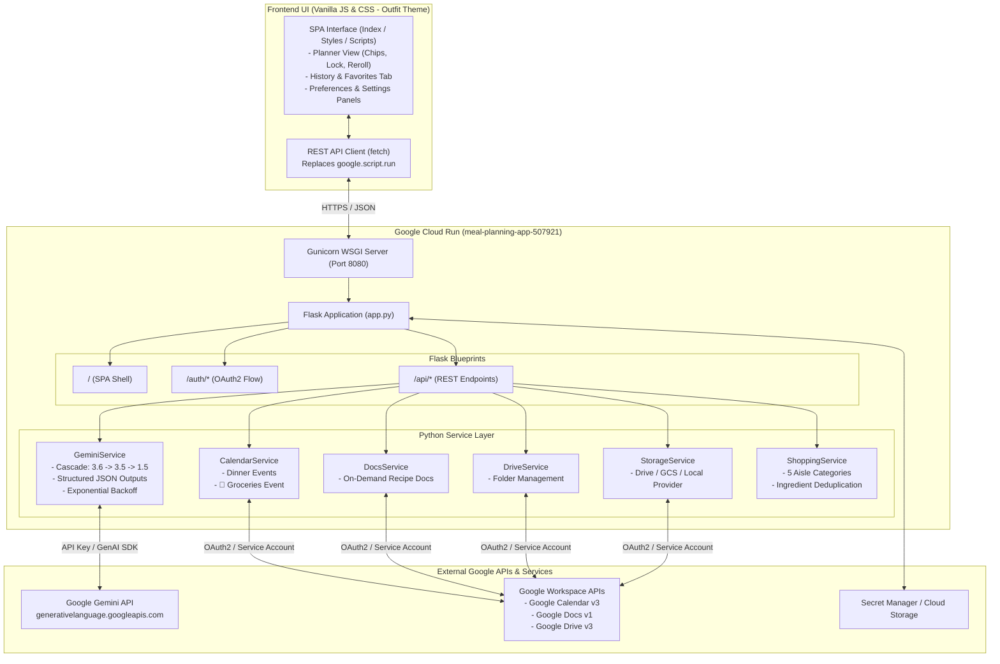

# Technical Specification: Meal Planning Assistant — Cloud Run Refactoring

**Project ID**: `meal-planning-app-507921`  
**Target Environment**: Google Cloud Run (Containerized Python / Flask)  
**Source Baseline**: `Google Apps Script/Meal Planning`  
**Target Directory**: `Google Cloud Project/Meal Planning`  
**Date**: September 26, 2026  
**Status**: Pending Review & User Input  

---

## 1. Executive Summary & Objective

The objective of this project is to refactor the standalone Google Apps Script (GAS) **Meal Planning Assistant** into an identical, production-ready, containerized Python/Flask web application hosted on **Google Cloud Run** under project **`meal-planning-app-507921`**.

The refactored application will preserve 100% of the features, rich visual aesthetics, and user workflow of the GAS version while taking advantage of:
- **Cloud Run Serverless Hosting**: Auto-scaling, HTTPS termination, high reliability, zero idle costs, and container portability.
- **Modern Python/Flask Backend**: Clean separation of concerns (routes, services, repositories), robust error handling, automated testing with `pytest`, and modern Google Cloud client libraries.
- **RESTful Client-Server Communication**: Replacing GAS-specific `google.script.run` with standardized REST JSON endpoints via a native `fetch()` client.
- **Workspace Continuity**: Preserving calendar scheduling, on-demand Google Docs recipe creation, and database schema compatibility with the existing `Automated_Meal_Planner_DB.json`.

---

## 2. Architecture Comparison: Apps Script vs. Cloud Run



### Detailed Component Comparison

| Dimension | Google Apps Script (Current) | Google Cloud Run Refactored (Target) |
| :--- | :--- | :--- |
| **Runtime & Execution** | Google Apps Script V8 runtime (serverless proprietary Google sandbox) | Python 3.11-slim + Gunicorn inside Docker on Google Cloud Run |
| **Backend Framework** | Monolithic `Code.gs` procedural functions | Modular Python/Flask application with Blueprints (`views`, `api`, `auth`) |
| **Frontend Serving** | `doGet(e)` with `HtmlService` inlining `Styles.html` and `JavaScript.html` | Flask Jinja2 template (`templates/index.html`) serving modular static CSS/JS |
| **Client-Server RPC** | Proprietary `google.script.run` asynchronous bridge | Standard RESTful API (`fetch('/api/...')`) with structured JSON |
| **Database Persistence** | Drive file `Automated_Meal_Planner_DB.json` in user's root Drive | **Pluggable Storage Engine**: Google Drive API (100% backward compatible) with GCS/Local fallbacks |
| **Google Calendar** | `CalendarApp.getDefaultCalendar()` (implicit user auth) | Google Calendar API v3 (`googleapiclient.discovery`) |
| **Google Docs** | `DocumentApp.create()` (implicit user auth) | Google Docs API v1 + Drive API v3 for on-demand recipe docs |
| **Gemini AI Integration** | `UrlFetchApp` REST calls with model cascade | Official Google GenAI SDK (`google-genai` / REST) with identical cascade and retry logic |
| **Authentication** | Automatic Workspace OAuth via Apps Script manifest | **Google OAuth 2.0 Web Flow** (or Service Account with shared calendar/drive) |
| **Packaging & CI/CD** | `npm run ship` (`clasp push && clasp deploy`) | Docker container build + `gcloud run deploy` (via `deploy.sh`) |

---

## 3. Directory & File Structure

All new project files will be authored directly in `Google Cloud Project/Meal Planning`:

```
Google Cloud Project/Meal Planning/
├── Dockerfile                      # Production container image definition (Python 3.11-slim + Gunicorn)
├── .dockerignore                   # Docker exclusion rules
├── .env.example                    # Template for environment variables and secrets
├── .gitignore                      # Git ignore rules for Python, virtualenv, and secrets
├── README.md                       # Comprehensive setup, run, and deployment documentation
├── requirements.txt                # Production Python dependencies
├── app.py                          # Flask application factory and entry point
├── config.py                       # App settings, environment loading, constants
├── deploy.sh                       # Single-command automated Cloud Run deployment script
├── cloudbuild.yaml                 # Optional Cloud Build pipeline config for CI/CD
│
├── spec/                           # Architecture specifications & design documentation
│   └── cloud_run_refactoring_spec.md # This specification document
│
├── core/                           # Core utilities, authentication, and exception handlers
│   ├── __init__.py
│   ├── auth.py                     # Google OAuth 2.0 flow & credential management
│   ├── config_keys.py              # Constant keys and aisle definitions
│   └── exceptions.py               # Custom application exceptions
│
├── services/                       # Business logic services
│   ├── __init__.py
│   ├── gemini_service.py           # Gemini AI prompting, structured schema, cascade & retry
│   ├── calendar_service.py         # Google Calendar event scheduling (dinners + groceries)
│   ├── docs_service.py             # Google Docs on-demand recipe formatting
│   ├── drive_service.py            # Drive folder discovery and file operations
│   ├── shopping_service.py         # Aisle categorizer (5 sections) and list deduplicator
│   └── storage_service.py          # Storage provider interface (Drive, GCS, Local JSON)
│
├── routes/                         # Flask endpoints
│   ├── __init__.py
│   ├── views.py                    # HTML shell and OAuth redirect handlers
│   └── api.py                      # REST API endpoints mapping 1:1 with Apps Script methods
│
├── static/                         # Static assets (modularized from Styles.html & JavaScript.html)
│   ├── css/
│   │   └── styles.css              # Dark mode, glassmorphism, Outfit font, responsive layout
│   └── js/
│       ├── api_client.js           # Lightweight REST fetch client matching google.script.run
│       └── app.js                  # Client-side state machine, DOM rendering, card handlers
│
├── templates/
│   └── index.html                  # Jinja2 HTML layout refactored from Index.html
│
└── tests/                          # Test suite (pytest)
    ├── conftest.py                 # Test fixtures, mock credentials, mock DB
    ├── test_api_routes.py          # Integration tests for /api endpoints
    ├── test_gemini_service.py      # Unit tests for prompt generation and cascade fallback
    ├── test_shopping_service.py    # Unit tests for aisle categorization and consolidation
    └── test_storage_service.py     # Unit tests for JSON schema migration and storage operations
```

---

## 4. Backend REST API Specification

To preserve client-side compatibility, every server function in `Code.gs` maps 1:1 to a clean REST endpoint:

| Apps Script Function (`Code.gs`) | HTTP Method & Route | Request Body | Response Payload | Description |
| :--- | :--- | :--- | :--- | :--- |
| `loadAppData()` | `GET /api/data` | None | `{ "db": {...}, "hasApiKey": bool, "apiKeyStatus": {...} }` | Loads preferences, active plan, ratings, and library |
| `savePreferences(prefs)` | `POST /api/preferences` | `{ "allergies": "", "dietaryPreferences": "", "dinersCount": 2, "defaultMealTime": "06:00 PM", "skipWelcomePage": false }` | `{ "success": true, "db": {...} }` | Updates user defaults and persists to database |
| `setSkipWelcomePreference(skip)` | `POST /api/preferences/skip-welcome` | `{ "skip": true }` | `{ "success": true, "skipWelcomePage": true }` | Quick toggle for startup welcome page |
| `saveApiKey(apiKey)` | `POST /api/settings/api-key` | `{ "apiKey": "AIzaSy..." }` | `{ "success": true, "apiKeyStatus": {...} }` | Saves personal Gemini API key override |
| `deleteApiKey()` | `DELETE /api/settings/api-key` | None | `{ "success": true, "apiKeyStatus": {...} }` | Clears personal API key override |
| `generateMealPlanServer(...)` | `POST /api/meal-plan/generate` | `{ "mealCount": 4, "planPreferences": "", "reusedRecipeNames": [], "selectedTags": [], "lockedIndices": [], "pantryIngredients": [] }` | `{ "success": true, "db": {...} }` | Calls Gemini AI cascade and merges locked/reused dishes |
| `rerollSingleRecipeServer(...)` | `POST /api/meal-plan/reroll` | `{ "targetIndex": 0, "existingRecipes": [...], "planPreferences": "", "selectedTags": [], "pantryIngredients": [] }` | `{ "success": true, "newRecipe": {...}, "targetIndex": 0, "db": {...} }` | AI generates a single unique replacement meal |
| `saveActiveMealPlanServer(...)` | `PUT /api/meal-plan/active` | `{ "recipes": [...] }` | `{ "success": true, "db": {...} }` | Saves reordered or modified active recipes |
| `approveMealPlanServer(...)` | `POST /api/meal-plan/approve` | `{ "approvedMealsWithDates": [{ "name": "...", "date": "YYYY-MM-DD" }] }` | `{ "success": true, "db": {...} }` | Creates Google Calendar dinner and grocery events |
| `createRecipeDocServer(name)` | `POST /api/recipes/create-doc` | `{ "recipeName": "..." }` | `{ "success": true, "docUrl": "...", "docId": "..." }` | Generates formatted on-demand Google Doc in Drive |
| `getRecipeHistory()` | `GET /api/recipes/history` | None | `{ "history": [...], "favorites": [...], "ratings": {...}, "library": {...} }` | Retrieves scheduled recipe history and favorites |
| `toggleFavoriteRecipeServer(...)` | `POST /api/recipes/favorite` | `{ "recipeName": "...", "isFavorite": true, "recipeObj": {...} }` | `{ "success": true, "isFavorite": true, "recipeRatings": {...}, "recipeLibrary": {...} }` | Toggles star bookmark and caches recipe library |
| `setRecipeRating(name, rating)`| `POST /api/recipes/rating` | `{ "recipeName": "...", "rating": 5 }` | `{ "success": true, "rating": 5, "recipeRatings": {...} }` | Sets numeric star rating (0–5) |
| `syncShoppingChecklistServer(...)`| `POST /api/shopping/sync` | `{ "checkedItems": [...], "customItems": [...] }` | `{ "success": true, "timestamp": "...", "checkedCount": 0 }` | Syncs checklist progress |

---

## 5. Google Workspace API & Authentication Strategy

In Google Apps Script, authentication with Google Calendar, Drive, and Docs was implicit because scripts run inside Google's user container. On Cloud Run, the application runs as an independent container service.

### Authentication Architectures:

#### Architecture A: User OAuth 2.0 Web Flow (Recommended)
- **How it works**:
  - The user visits the app. If unauthenticated, a secure Google Sign-In prompt initiates.
  - The app requests the following OAuth scopes:
    - `https://www.googleapis.com/auth/calendar` (Manage dinner and grocery events)
    - `https://www.googleapis.com/auth/drive.file` (Create/read `Automated_Meal_Planner_DB.json` and "Meal Plan Recipes" folder without full drive access)
    - `https://www.googleapis.com/auth/documents` (Create on-demand recipe docs)
  - Tokens (access + refresh) are stored in an encrypted session cookie or local secure token vault.
- **Benefits**:
  - Exactly replicates Apps Script: Calendar events are created on Phil's personal calendar, Docs are created in his personal Drive, and the database file remains visible and editable in his Drive.
  - Full data continuity with previous GAS usage.

#### Architecture B: GCP Service Account with Shared Resources
- **How it works**:
  - A Google Cloud Service Account (e.g. `meal-planner-sa@meal-planning-app-507921.iam.gserviceaccount.com`) is provisioned with a private key.
  - Phil shares his Google Calendar and a Google Drive folder (`Meal Plan Recipes`) with the Service Account email address.
- **Benefits**:
  - No interactive user login prompt; completely automated for a single dedicated user.
- **Limitations**:
  - Requires manually sharing personal calendar and folders with the service account email. Cannot automatically find "Primary Calendar" without calendar ID sharing.

#### Architecture C: Hybrid Storage & Export Mode
- The database can reside either in Google Drive (via OAuth) OR in a private Google Cloud Storage (GCS) bucket (`gs://meal-planning-app-507921-data/Automated_Meal_Planner_DB.json`).
- If Google Calendar is connected, events are scheduled automatically; if not, calendar entries can also be downloaded directly as an `.ics` iCalendar file for 1-click import into Google Calendar or Apple Calendar.

---

## 6. Gemini AI Engine Refactoring

The AI generation layer in `gemini_service.py` will strictly replicate the proven prompt structure and resilience cascade from `Code.gs`:

1. **Model Cascade**:
   - Primary: `gemini-3.6-flash`
   - Fallback 1: `gemini-3.5-flash`
   - Fallback 2: `gemini-1.5-flash`
2. **Exponential Backoff**:
   - Automatically catches 503, 502, 504, and 500 transient errors.
   - Retries up to 3 times per model with jitter (`delayMs = 1500 * 2^attempt + rand(500)`).
   - Automatically skips 404 (model deprecated/missing) to the next cascade entry without burning retries.
3. **Structured JSON Output**:
   - Enforces the strict JSON response schema using `generationConfig: { responseMimeType: "application/json", responseSchema: ... }`.
4. **Directives & Constraints**:
   - Incorporates all allergy constraints, dietary/cuisine preferences, diner count scaling, preset tags (`quick`, `one_pot`, `kid_friendly`, `slow_cooker`, `high_veggie`, `comfort`), pantry ingredient priorities, and duplicate dish avoidance.

---

## 7. Containerization & Cloud Run Deployment

### Dockerfile Specification

```dockerfile
# Multi-stage lightweight Python container
FROM python:3.11-slim as base

ENV PYTHONDONTWRITEBYTECODE=1 \
    PYTHONUNBUFFERED=1 \
    PORT=8080 \
    APP_HOME=/app

WORKDIR $APP_HOME

# Install system dependencies
RUN apt-get update && apt-get install -y --no-install-recommends \
    curl \
    ca-certificates \
    && rm -rf /var/lib/apt/lists/*

# Install Python dependencies
COPY requirements.txt .
RUN pip install --no-cache-dir --upgrade pip && \
    pip install --no-cache-dir -r requirements.txt

# Copy application source
COPY . .

# Create non-root application user for container security
RUN useradd -m -u 1000 appuser && chown -R appuser:appuser $APP_HOME
USER appuser

EXPOSE 8080

# Production WSGI server execution
CMD ["gunicorn", "--bind", "0.0.0.0:8080", "--workers", "1", "--threads", "8", "--timeout", "0", "app:app"]
```

### Automated Deployment Script (`deploy.sh`)

A single-command release script replacing `npm run ship`:
1. Validates Google Cloud CLI authentication and active project (`meal-planning-app-507921`).
2. Enables required Cloud APIs (`run.googleapis.com`, `artifactregistry.googleapis.com`, `calendar-json.googleapis.com`, `docs.googleapis.com`, `drive.googleapis.com`, `secretmanager.googleapis.com`).
3. Builds the container image and deploys to Cloud Run in `us-central1`.
4. Outputs the secure Cloud Run service URL (e.g. `https://meal-planning-app-xyz.a.run.app`).

---

## 8. Implementation Phases & Milestones

| Phase | Milestone | Deliverables |
| :--- | :--- | :--- |
| **Phase 1** | **Foundation & Project Scaffolding** | Setup `Google Cloud Project/Meal Planning/` directory tree, `config.py`, `requirements.txt`, `app.py`, `.env.example`, `Dockerfile`. |
| **Phase 2** | **Core Services & Business Logic** | Implement `shopping_service.py`, `gemini_service.py` (with cascade and schema), `storage_service.py` (with schema auto-migration). |
| **Phase 3** | **Google Workspace Services** | Implement `auth.py` (OAuth2 / Service Account), `calendar_service.py` (dinner & grocery events), `docs_service.py`, and `drive_service.py`. |
| **Phase 4** | **REST API Routes & Testing** | Implement `routes/api.py` and `routes/views.py`. Write pytest suite for 100% test coverage matching existing test cases. |
| **Phase 5** | **Frontend Assets & REST Client** | Extract CSS to `styles.css`, construct Jinja `index.html`, refactor `app.js` with `api_client.js` replacing `google.script.run`. |
| **Phase 6** | **Cloud Run Deployment & Verification**| Execute `deploy.sh` to project `meal-planning-app-507921`, verify live endpoints, calendar event creation, and on-demand doc generation. |

---

## 9. Confirmed Architectural Decisions

The following architectural choices have been approved for implementation:

1. **Authentication Strategy — Google OAuth 2.0 Web Sign-In**:
   - The app will implement standard Google OAuth 2.0 (Authorization Code flow with offline access / refresh tokens).
   - Scopes:
     - `https://www.googleapis.com/auth/calendar` (Google Calendar event creation)
     - `https://www.googleapis.com/auth/drive.file` (Drive access limited to files created/opened by the app)
     - `https://www.googleapis.com/auth/documents` (Google Docs recipe creation)
     - `openid`, `email`, `profile` (User authentication)
   - Credentials (`client_id` and `client_secret` from GCP OAuth Consent Screen) will be configured via environment variables.

2. **Database Persistence — Google Drive Continuity**:
   - The primary database will remain `Automated_Meal_Planner_DB.json` in the user's personal Google Drive root folder.
   - When the user signs in with Google, the app accesses and mutates the exact same database file used by Google Apps Script, guaranteeing 100% backward compatibility and immediate access to existing preferences, meal plans, and family favorites.
   - A local JSON file fallback will be provided for headless offline testing.

3. **Cloud Run Ingress & Access Control — Public HTTPS with Application-Level Google Auth**:
   - Cloud Run service will be deployed with `--allow-unauthenticated` so the web app can be visited easily across desktop and mobile browsers.
   - Unauthenticated sessions will be redirected to the secure Google Sign-In flow before viewing or modifying personal meal plans.

4. **Gemini Starter Key**:
   - Deployed with a default starter `GEMINI_API_KEY` environment variable in Cloud Run, while preserving the user's ability to input a personal AI Studio key override in the **Settings** view.
